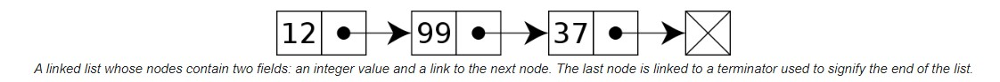

A linked list is a linear data structure where each element is a separate object. 
Linked list elements are not stored at contiguous memory location's, the elements are linked to each other via the memory address.
Each node of a list is made up of two items - the data and a reference to the next node(address of the next node).
The last node has a reference to null.

